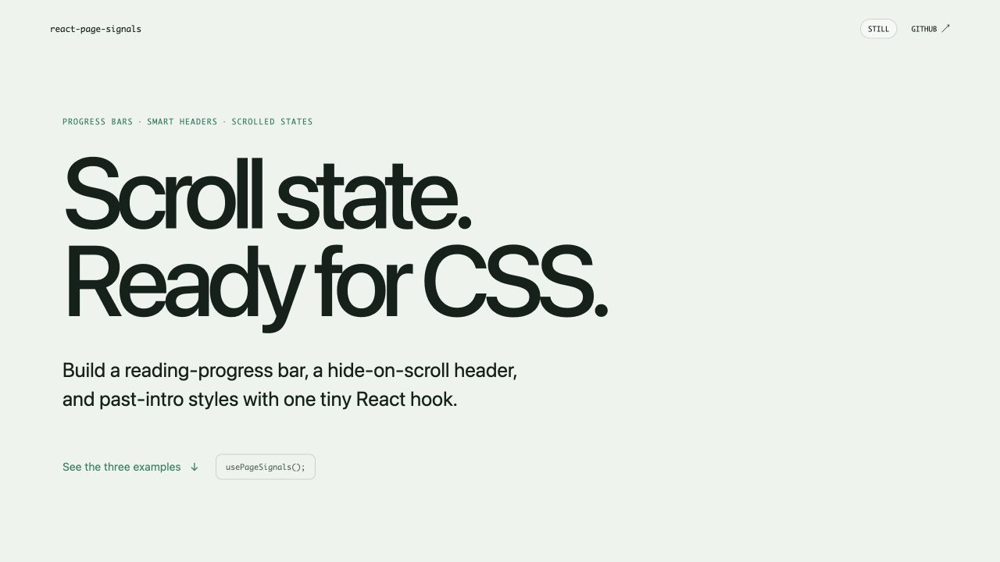

# react-page-signals

Build reading-progress bars, hide-on-scroll headers, and past-intro styles with
one tiny React hook.

[Live demo](https://w3cdp6084-dev.github.io/react-page-signals/) ·
[日本語](./README.ja.md)



## What can I build with it?

| UI behavior | Signal you style |
| --- | --- |
| A reading-progress bar | `--scroll-progress` from `0` to `1` |
| A header that hides down and returns up | `data-scroll-direction` |
| A compact header after the intro | `data-is-scrolled` |
| Parallax or scroll-linked spacing | `--scroll-y` in pixels |

The hook updates CSS variables and `data-*` attributes directly. It does not
set React state while the user scrolls.

## The 30-second example

Call the hook once near the root of your app:

```tsx
import { usePageSignals } from "react-page-signals";

export function App() {
  usePageSignals({ scrolledThreshold: 80 });

  return (
    <>
      <div className="reading-progress" />
      <header className="site-header">My site</header>
      <main>{/* A long page */}</main>
    </>
  );
}
```

React is finished. The interactions live in CSS:

```css
.reading-progress {
  transform: scaleX(var(--scroll-progress));
  transform-origin: left;
}

[data-scroll-direction="down"] .site-header {
  transform: translateY(-100%);
}

[data-scroll-direction="up"] .site-header {
  transform: translateY(0);
}

[data-is-scrolled="true"] .site-header {
  backdrop-filter: blur(16px);
}
```

Open the [live demo](https://w3cdp6084-dev.github.io/react-page-signals/) and
scroll to see all three signals in use.

## Try the current source

The first npm release is not published yet. You can run the project locally:

```bash
git clone https://github.com/w3cdp6084-dev/react-page-signals.git
cd react-page-signals
pnpm install
pnpm dev
```

Then open the local URL printed by Vite.

## What gets written?

By default, the hook writes these values to `<html>`:

```html
<html
  style="--scroll-progress: 0.42; --scroll-y: 860px"
  data-scroll-direction="down"
  data-is-scrolled="true"
>
```

Updates are batched with `requestAnimationFrame`. Existing values are restored
when the hook unmounts.

## Options

```tsx
usePageSignals({
  scrolledThreshold: 80,
  progressVariable: "--reading-progress",
  scrollYVariable: "--reading-y",
  directionAttribute: "data-reading-direction",
  scrolledAttribute: "data-past-intro",
});
```

| Option | Default | Description |
| --- | --- | --- |
| `target` | `document.documentElement` | Element that receives the signals |
| `scrolledThreshold` | `24` | Pixels before the scrolled attribute becomes `true` |
| `progressVariable` | `--scroll-progress` | Unitless progress from `0` to `1` |
| `scrollYVariable` | `--scroll-y` | Current page scroll position in pixels |
| `directionAttribute` | `data-scroll-direction` | Receives `up`, `down`, or `none` |
| `scrolledAttribute` | `data-is-scrolled` | Receives `true` or `false` |
| `disabled` | `false` | Disables observation without conditionally calling the hook |

For non-React integrations, the package also exports `observePageSignals`:

```ts
import { observePageSignals } from "react-page-signals";

const stop = observePageSignals();
stop();
```

## Project goals

- Stay small and CSS-first
- Avoid React rerenders during scroll
- Keep the default API useful without configuration
- Remain SSR-safe and fully typed
- Restore the page to its previous state on cleanup

## Development

```bash
pnpm install
pnpm dev
pnpm check
```

See [CONTRIBUTING.md](./CONTRIBUTING.md) before opening a pull request.

## License

[MIT](./LICENSE) © Yusuke Mori
